# DepGuarder Workbook

## Project Concept

**DepGuarder** is a developer-first dependency security tool that scans `package.json`, lockfiles, and dependency metadata to detect malicious, suspicious, or risky npm packages before they are installed, merged, or deployed.

The goal is not only to find known vulnerabilities, but to answer:

> “Can I trust this package right now?”

---

## 1. Target Users

### Individual Developers
Developers cloning repos, installing packages, or adding new dependencies.

### Open Source Maintainers
Maintainers reviewing dependency changes in pull requests.

### Engineering Teams
Teams that want dependency risk controls in CI/CD.

### Security Teams
Teams that need visibility across multiple repositories.

---

## 2. Core Use Cases

1. Scan a newly cloned repository before running `npm install`.
2. Scan an existing repository for suspicious dependencies.
3. Detect risky dependencies added in a pull request.
4. Block dangerous installs through a safe install wrapper.
5. Monitor dependency changes across an organization.
6. Generate trust/risk reports for packages.

---

## 3. User Flow: New Repository

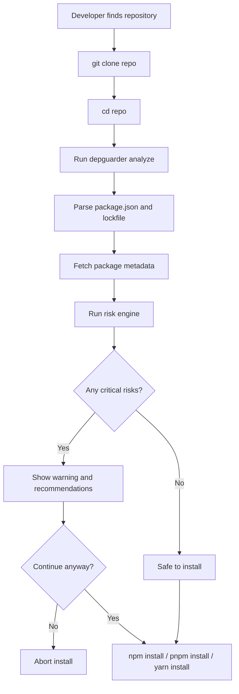

### Ideal Command

```bash
npx depguarder analyze
```

### Safe Install Wrapper

```bash
npx depguarder install
```

This runs a scan before executing package manager install commands.

---

## 4. User Flow: Existing Repository

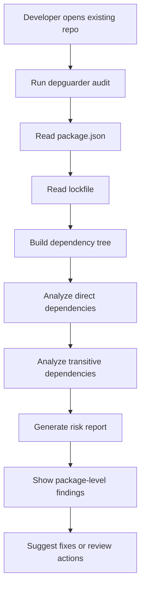

### Example Command

```bash
depguarder audit
```

---

## 5. User Flow: Adding a New Dependency

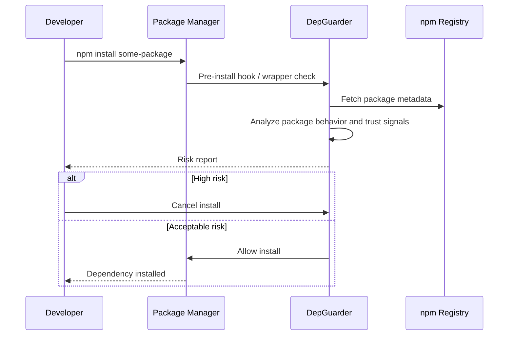

---

## 6. Pull Request Flow

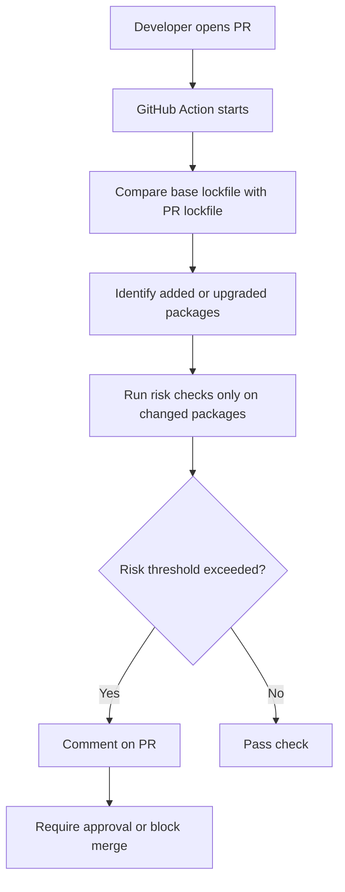

### PR Comment Example

```text
Dependency Risk Report

Added:
- fast-logger@1.0.2

Risk Score: 82 / 100
Severity: High

Reasons:
- Package created 3 days ago
- Has postinstall script
- Similar name to popular package fast-log
- Single maintainer

Recommendation:
Do not merge until manually reviewed.
```

---

## 7. High-Level Architecture

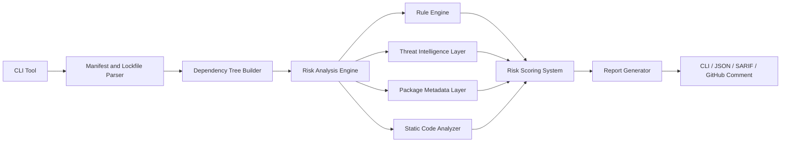

---

## 8. System Components

### 8.1 CLI

Responsible for user-facing commands.

Commands:

```bash
depguarder analyze
depguarder audit
depguarder diff
depguarder install
depguarder ci
depguarder explain <package>
```

---

### 8.2 Manifest Parser

Reads:

- `package.json`
- `package-lock.json`
- `yarn.lock`
- `pnpm-lock.yaml`

Extracts:

- Direct dependencies
- Dev dependencies
- Peer dependencies
- Optional dependencies
- Transitive dependencies
- Version ranges
- Resolved versions
- Registry URLs

---

### 8.3 Dependency Tree Builder

Builds a full dependency graph from lockfiles.

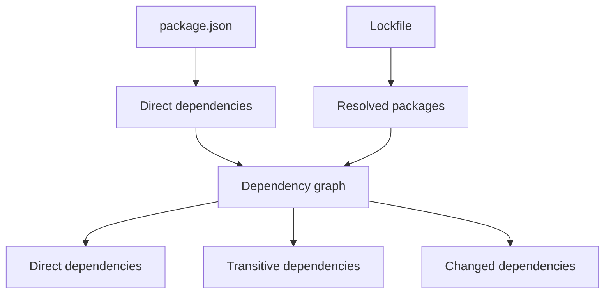

---

### 8.4 Metadata Collector

Collects npm/package metadata:

- Package age
- Version age
- Maintainers
- Repository URL
- License
- Weekly downloads
- Publish frequency
- Dist-tags
- Tarball URL
- Integrity hash
- Package scripts
- Registry source

---

### 8.5 Static Analyzer

Downloads package tarball safely without executing it.

Checks for:

- Install scripts
- Obfuscated JavaScript
- Suspicious shell commands
- Network calls
- Environment variable access
- Credential file access
- Child process usage
- Base64 encoded payloads
- Dynamic eval usage
- Minified code in unexpected places

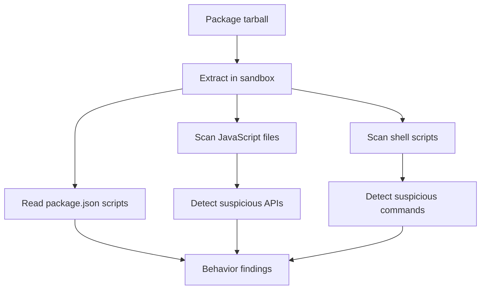

---

## 9. Risk Scoring Model

Each package receives a score from 0 to 100.

| Signal | Example | Score Impact |
|---|---|---:|
| Known malware | Listed in threat DB | +100 |
| Install script | `postinstall` present | +20 |
| Typosquatting | Similar to popular package | +30 |
| Very new package | Created < 7 days ago | +15 |
| New version | Published < 24 hours ago | +10 |
| Obfuscated code | Encoded/eval-heavy files | +25 |
| Network access | Calls unknown domains | +20 |
| Env access | Reads secrets/env vars | +20 |
| Missing repo | No source repository | +10 |
| Single maintainer | One maintainer only | +10 |
| Maintainer change | Recent maintainer change | +25 |
| Dependency confusion | Private-looking name public | +40 |

---

## 10. Severity Mapping

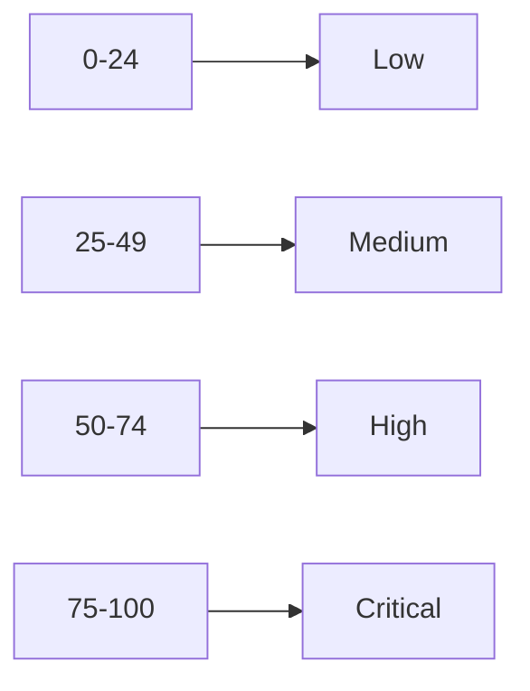

Recommended mapping:

- **0–24:** Low
- **25–49:** Medium
- **50–74:** High
- **75–100:** Critical

---

## 11. Detection Categories

### Known Bad Packages
Matches packages against known malicious package databases.

### Suspicious Metadata
Packages with weak trust signals.

### Suspicious Behavior
Packages that perform risky actions.

### Typosquatting
Packages with names close to popular packages.

### Dependency Confusion
Packages that look internal but resolve publicly.

### Supply Chain Compromise
Popular packages with unusual new releases, maintainer changes, or suspicious diffs.

---

## 12. Package Analysis Flow

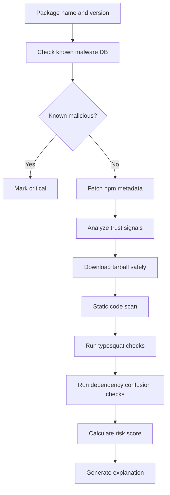

---

## 13. Data Sources

Potential data sources:

- npm registry metadata
- GitHub Advisory Database
- OSV database
- Socket-style threat intelligence
- OpenSSF Scorecard data
- Package download statistics
- Package repository metadata
- Internal organization allowlist/blocklist

---

## 14. Output Formats

### Human-readable CLI

```text
Risk Report

Package: browserlist@1.0.0
Severity: Critical
Score: 91/100

Reasons:
- Similar to popular package browserslist
- Package is 2 days old
- Has postinstall script
- Reads environment variables

Recommendation:
Do not install.
```

### JSON

```json
{
  "package": "browserlist",
  "version": "1.0.0",
  "score": 91,
  "severity": "critical",
  "findings": [
    "typosquatting",
    "new-package",
    "postinstall-script",
    "env-access"
  ]
}
```

### SARIF
For GitHub Advanced Security integration.

---

## 15. MVP Scope

### MVP Features

1. Scan `package.json`.
2. Scan one lockfile format first: `package-lock.json`.
3. Fetch npm metadata.
4. Detect install scripts.
5. Detect new packages and new versions.
6. Detect missing repository.
7. Basic typosquatting check.
8. Basic risk scoring.
9. CLI text report.
10. GitHub Action for PR checks.

### Avoid in MVP

- Full malware sandboxing
- AI-only detection
- Enterprise dashboard
- Multi-ecosystem support
- Automatic package removal

---

## 16. Suggested Tech Stack

### CLI

- Node.js
- TypeScript
- Commander.js or Clipanion
- npm registry API
- pacote for package fetching
- lockfile parsers

### Analysis Engine

- TypeScript rules engine
- AST parsing with Babel parser or SWC
- String/static pattern detection

### GitHub Action

- Node.js GitHub Action
- Markdown PR comments
- JSON report artifact

### Backend Later

- PostgreSQL
- Redis
- Queue system
- Worker service for package analysis
- Dashboard frontend

---

## 17. Proposed Repository Structure

```text
depguarder/
  packages/
    cli/
    core/
    rules/
    lockfile-parser/
    github-action/
  examples/
  docs/
  tests/
  package.json
```

---

## 18. Internal Engine Architecture

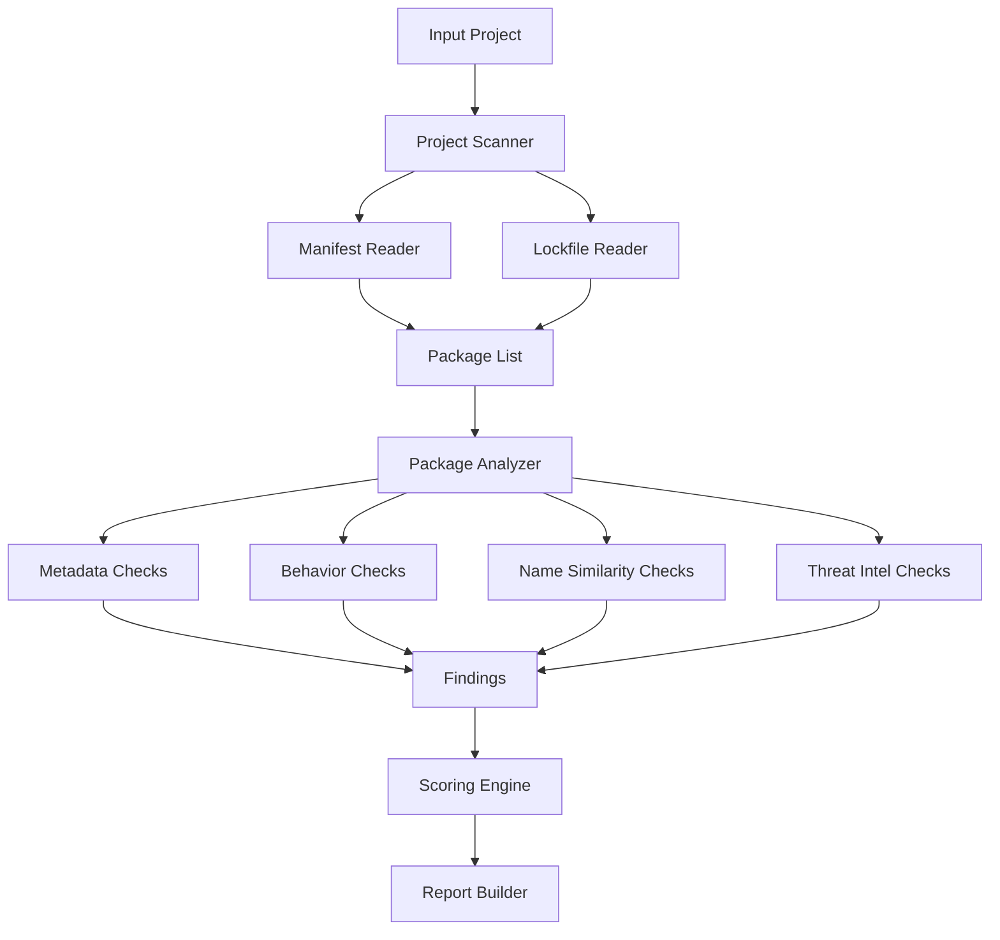

---

## 19. Rule Engine Design

Each rule should return findings, not just scores.

```ts
export interface RuleFinding {
  id: string;
  title: string;
  severity: 'low' | 'medium' | 'high' | 'critical';
  scoreImpact: number;
  evidence: string[];
  recommendation: string;
}
```

Example rule:

```ts
const postInstallRule = {
  id: 'postinstall-script',
  run(pkg) {
    if (pkg.scripts?.postinstall) {
      return {
        id: 'postinstall-script',
        title: 'Package has a postinstall script',
        severity: 'high',
        scoreImpact: 20,
        evidence: [pkg.scripts.postinstall],
        recommendation: 'Review the install script before installing.'
      };
    }
  }
};
```

---

## 20. Risk Report Design

The report should answer five questions:

1. What package is risky?
2. How risky is it?
3. Why is it risky?
4. What evidence was found?
5. What should the developer do next?

---

## 21. CLI UX

```bash
depguarder analyze
```

```text
DepGuarder Security Report

Repository Risk: High
Packages scanned: 1,284
Critical: 1
High: 3
Medium: 12
Low: 40

Critical Findings

1. browserlist@1.0.0
   Score: 94/100
   Reason: Possible typosquat of browserslist
   Evidence: Name similarity 96%
   Recommendation: Replace with browserslist or remove.
```

---

## 22. GitHub Action UX

```yaml
name: Dependency Guard

on:
  pull_request:

jobs:
  depguarder:
    runs-on: ubuntu-latest
    steps:
      - uses: actions/checkout@v4
      - uses: depguarder/action@v1
        with:
          fail-on: high
```

---

## 23. Roadmap

### Phase 1: Prototype

- CLI scanner
- package.json parser
- npm metadata fetching
- basic scoring
- text report

### Phase 2: Practical MVP

- lockfile support
- GitHub Action
- diff scanning
- typosquat detection
- install script detection

### Phase 3: Advanced Detection

- static code analyzer
- suspicious API detection
- package tarball diffing
- maintainer change detection
- cooldown policy

### Phase 4: Team Product

- org dashboard
- repository monitoring
- allowlists/blocklists
- policy management
- Slack/email alerts

---

## 24. MVP Build Plan

### Week 1

- Set up monorepo
- Build CLI shell
- Parse package.json
- Fetch npm metadata

### Week 2

- Parse package-lock.json
- Build dependency list
- Add basic rules
- Add scoring system

### Week 3

- Add report generator
- Add typosquat detection
- Add install script detection
- Add JSON output

### Week 4

- Build GitHub Action
- Add PR diff mode
- Write docs
- Test on real repos

---

## 25. Differentiation

DepGuarder should not position itself as another vulnerability scanner.

Better positioning:

> “A pre-install trust scanner for JavaScript dependencies.”

Key difference:

- Vulnerability scanners detect known CVEs.
- DepGuarder detects suspicious packages before they become known incidents.

---

## 26. Future Ideas

- Browser extension for npm package pages
- VS Code extension
- npm install wrapper
- AI-assisted explanation of findings
- Team package approval workflow
- Private registry policy enforcement
- Package reputation API
- Real-time package release monitoring

---

## 27. Success Metrics

### Developer Metrics

- Number of scans run
- Number of risky installs prevented
- Time to scan
- False positive rate
- GitHub Action adoption

### Business Metrics

- Repositories connected
- Teams onboarded
- Weekly active developers
- Paid team conversions
- Number of policy violations caught

---

## 28. Main Product Principle

DepGuarder should be fast, explainable, and developer-friendly.

A developer should never feel like the tool is saying:

> “Trust me, this is bad.”

It should say:

> “Here is what I found, here is why it matters, and here is what you can do next.”

---

## 18. Deeper Threat Model: Transitive Dependency Attacks

A key design requirement for DepGuarder is that it must not stop at `package.json`.

Attackers often avoid placing the malicious package directly in the top-level manifest. Instead, they hide it deeper in the dependency tree, where developers are less likely to review it manually.

### Why Surface-Level Scanning Is Not Enough

A project may only list 20 direct dependencies in `package.json`, but the lockfile may resolve hundreds or thousands of packages.

```text
package.json
└── direct dependency
    └── dependency
        └── dependency
            └── malicious package
```

The malicious package may be introduced through:

1. A direct dependency that depends on a malicious subdependency.
2. A compromised popular package that adds a malicious dependency.
3. A lockfile-only change where `package.json` looks normal.
4. A malicious package published under a name similar to a trusted package.
5. A maintainer compromise that publishes a poisoned version of an otherwise trusted package.
6. A dependency confusion attack where a private-looking package name resolves to a public malicious package.
7. A postinstall script buried several levels deep.

### Realistic Attack Shape

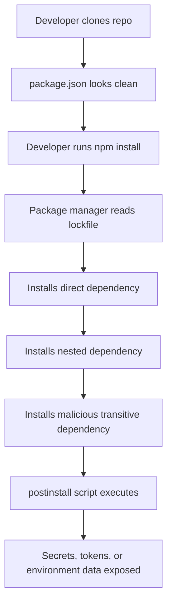

### DepGuarder Design Response

DepGuarder must scan the full resolved dependency graph, not only the manifest.

That means it should inspect:

- `package.json`
- `package-lock.json`
- `npm-shrinkwrap.json`
- `yarn.lock`
- `pnpm-lock.yaml`
- resolved package tarballs when deeper behavioral inspection is needed
- dependency metadata from npm registry
- known-malware databases such as OSV / OpenSSF malicious packages

---

## 19. Dependency Graph Analysis Architecture

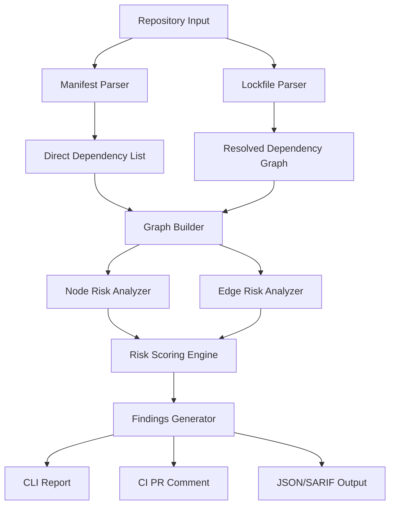

### Node Risk

A node is a package/version pair.

Example:

```text
plain-crypto-js@4.2.1
```

Node-level checks:

- Known malicious package/version
- Package age
- Version publish age
- Maintainer changes
- Install scripts
- Obfuscated files
- Suspicious network behavior
- Suspicious filesystem behavior
- Credential/environment access
- Missing repository
- Low download count
- Abnormal version jump
- Unusual package size change

### Edge Risk

An edge is the relationship between two packages.

Example:

```text
axios@1.14.1 -> plain-crypto-js@4.2.1
```

Edge-level checks:

- New transitive dependency introduced by package update
- Trusted package suddenly depending on unknown package
- Dependency points to Git URL, tarball, or non-registry source
- Resolved URL changed unexpectedly
- Integrity hash changed unexpectedly
- Version range resolves differently across environments
- Private-looking package resolves publicly

---

## 20. Graph Depth Strategy

DepGuarder should support multiple scan depths.

### Fast Mode

Used during local development.

```bash
depguarder scan --fast
```

Checks:

- Direct dependencies
- Lockfile changes
- Known malicious packages
- Install scripts
- Newly introduced transitive packages

### Full Mode

Used before install, before merge, or in CI.

```bash
depguarder scan --full
```

Checks:

- Entire dependency graph
- All transitive dependencies
- Registry metadata
- Known malware databases
- Behavioral package inspection
- Tarball inspection where needed

### Paranoid Mode

Used for sensitive projects.

```bash
depguarder scan --paranoid
```

Checks:

- Everything in full mode
- Download and unpack package tarballs in sandbox
- Static analysis of package contents
- Install script analysis without execution
- Suspicious string and API detection
- Diff against previous trusted version
- Maintainer and provenance checks

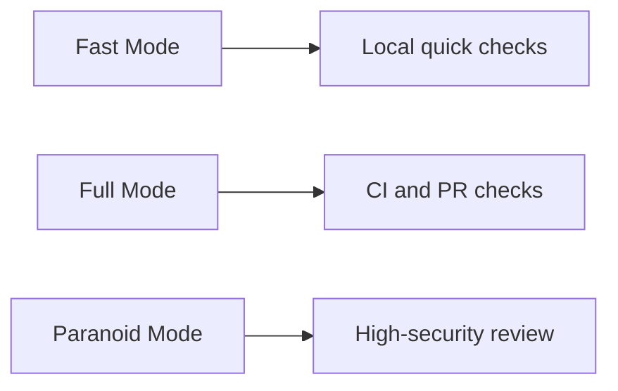

---

## 21. Transitive Dependency Scan Flow

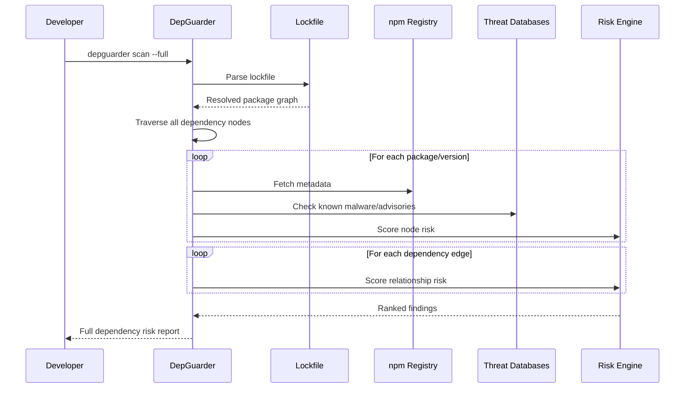

---

## 22. Lockfile-First Security Model

DepGuarder should treat the lockfile as the source of truth for what will actually be installed.

`package.json` tells us what the developer asked for.

The lockfile tells us what the package manager will install.

### Important Rule

If `package.json` looks clean but the lockfile changed, the lockfile must still be scanned.

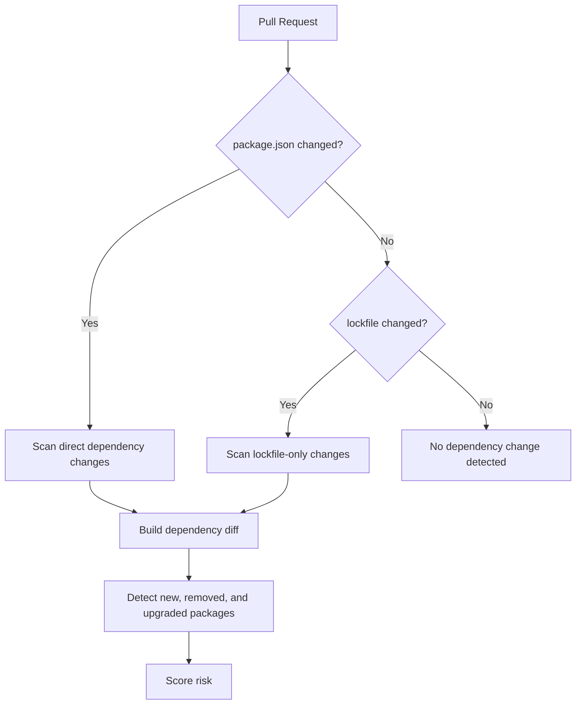

### Lockfile Attack Indicators

- New package appears only in lockfile
- Resolved URL changed
- Integrity changed
- Package source changed from registry to Git/tarball
- Same package name resolves to a different source
- Dependency version changed without a matching manifest change
- Lockfile has duplicate versions of the same package with different risk profiles

---

## 23. Dependency Diff Engine

The diff engine compares the previous trusted dependency graph with the new graph.

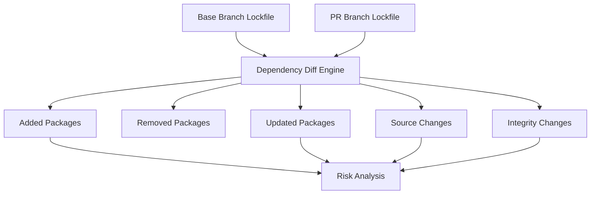

### Output Example

```text
New transitive dependency introduced:

axios@1.14.1
└── plain-crypto-js@4.2.1

Risk: Critical
Reasons:
- New dependency added by package update
- Similar name to crypto-js
- Contains postinstall script
- Version recently published
- Known malicious indicator matched
```

---

## 24. Package Relationship Report

Instead of only saying “bad package found,” DepGuarder should explain how it entered the project.

### Example Finding

```text
Critical Risk Found

Package:
plain-crypto-js@4.2.1

Introduced Through:
my-app
└── axios@1.14.1
    └── plain-crypto-js@4.2.1

Why This Matters:
This package is not listed directly in package.json.
It is installed as a transitive dependency, so a developer may not notice it during normal review.

Recommended Action:
- Block install
- Pin axios to a known safe version
- Remove affected lockfile entry
- Rotate secrets if installation already happened
```

---

## 25. Risk Scoring Model: Direct + Transitive

Risk should be calculated across both packages and paths.

```text
Final Risk = Package Risk + Path Risk + Change Risk + Context Risk
```

### Package Risk

How suspicious is this package by itself?

Examples:

- Known malware
- Typosquat name
- Install script
- Obfuscated files
- Suspicious APIs

### Path Risk

How did this package enter the project?

Examples:

- Direct dependency: visible to developer
- Transitive dependency: less visible
- Deep transitive dependency: harder to notice
- Introduced by a trusted package update: higher concern

### Change Risk

What changed recently?

Examples:

- New package in lockfile
- New version published recently
- New maintainer
- New install script
- New dependency edge
- New resolved source

### Context Risk

Where is this project running?

Examples:

- Local developer laptop
- CI/CD runner
- Production build system
- Repository with cloud credentials
- Monorepo with many packages

---

## 26. Graph-Based Risk Propagation

Risk should propagate upward through the dependency tree.

If a deep dependency is critical, the direct dependency that introduced it should also receive a warning.

```mermaid
flowchart BT
    A[malicious-subdep@1.0.0<br/>Risk: Critical] --> B[helper-lib@2.3.0<br/>Risk: Elevated]
    B --> C[trusted-framework@5.1.0<br/>Risk: Elevated because it introduces malicious-subdep]
    C --> D[my-app<br/>Project Risk: Critical]
```

### Why This Matters

Developers often ask:

> “But I never installed that package. Where did it come from?”

DepGuarder must answer that clearly.

---

## 27. Behavioral Analysis Without Executing Malware

DepGuarder should never run install scripts directly during analysis.

Instead, it should inspect package contents safely.

### Static Signals

- `scripts.install`
- `scripts.preinstall`
- `scripts.postinstall`
- `child_process` usage
- `fs` access to sensitive paths
- `process.env` access
- HTTP requests to unknown hosts
- Base64-encoded payloads
- Minified or obfuscated code in small packages
- Runtime downloads of binaries
- References to SSH keys, npm tokens, cloud credentials, or CI variables

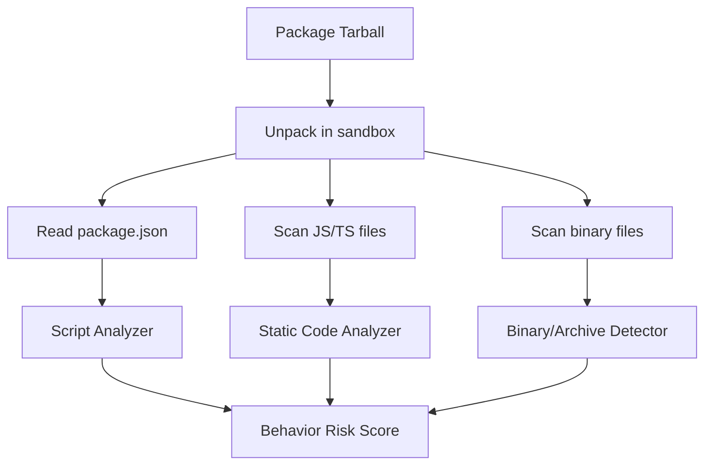

---

## 28. Attack Pattern Library

DepGuarder should maintain an internal library of attack patterns.

### Pattern 1: Typosquat as Transitive Dependency

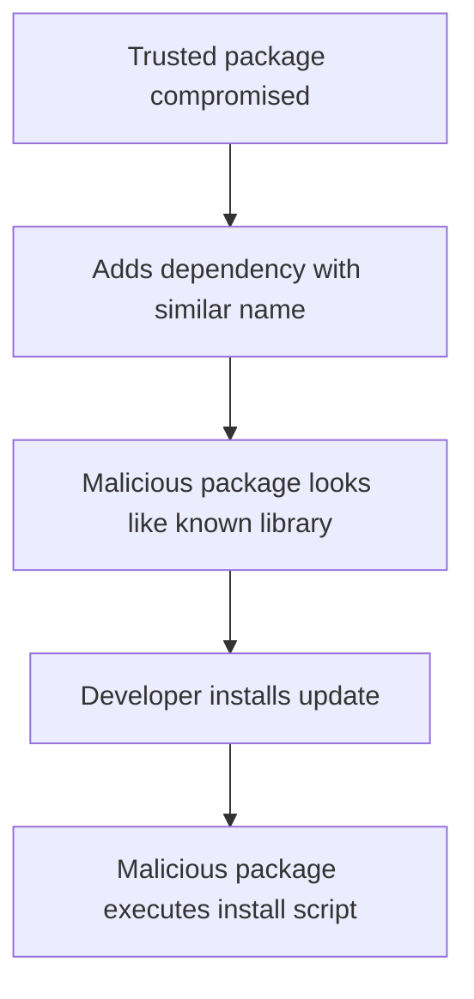

Signals:

- Package name similar to popular package
- New package age
- Low downloads
- Added by recently published version
- Install script present

### Pattern 2: Lockfile Poisoning

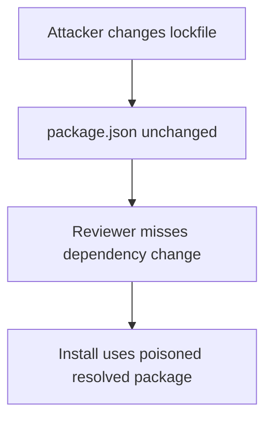

Signals:

- Lockfile changed without manifest change
- Resolved URL changed
- Integrity changed
- New tarball or Git source

### Pattern 3: Maintainer Account Compromise

```mermaid
flowchart TD
    A[Trusted maintainer account compromised] --> B[Malicious version published]
    B --> C[Package appears trusted by name]
    C --> D[Users auto-upgrade through semver range]
```

Signals:

- Popular package with very recent release
- Release not reflected in source repo tags
- Sudden new dependency
- New install script
- Unusual package contents

### Pattern 4: Dependency Confusion

```mermaid
flowchart TD
    A[Project references internal package name] --> B[Public registry has same name]
    B --> C[Package manager resolves public package]
    C --> D[Malicious public package installed]
```

Signals:

- Private-looking scope/name
- Public package with low history
- Registry source mismatch
- Missing internal registry config

### Pattern 5: Install Script Payload

```mermaid
flowchart TD
    A[Package installed] --> B[preinstall/install/postinstall runs]
    B --> C[Script downloads payload or reads secrets]
    C --> D[Data leaves developer or CI environment]
```

Signals:

- Lifecycle scripts
- Network calls
- Child process execution
- Dynamic downloads
- Environment variable access

---

## 29. Product Feature: Explainable Dependency Path

Every serious finding should include the full path from the application to the risky package.

### CLI Example

```text
depguarder scan --full

Critical: malicious-subdep@1.0.0

Dependency path:
my-app
└── build-tool@4.0.0
    └── helper-utils@2.1.0
        └── malicious-subdep@1.0.0

Depth: 3
Visibility: Transitive
First introduced in: PR #42
Risk source: Known malware + install script
```

### Why This Is Important

This makes the tool useful during code review because the reviewer can see:

- Which top-level package introduced the risk
- Whether it came from a direct install or transitive update
- Whether the risk is new or pre-existing
- What action to take

---

## 30. Updated MVP Scope

The MVP should include deep dependency scanning from the start.

### MVP Must-Haves

1. Parse `package.json`.
2. Parse at least `package-lock.json` first.
3. Build a full dependency graph.
4. Traverse all transitive dependencies.
5. Detect newly introduced transitive packages.
6. Query known malware/advisory sources.
7. Detect lifecycle install scripts.
8. Print explainable dependency paths.
9. Generate project risk score.
10. Provide CI-friendly JSON output.

### MVP Nice-to-Haves

1. `pnpm-lock.yaml` support.
2. `yarn.lock` support.
3. Package tarball static analysis.
4. Maintainer history checks.
5. GitHub PR comments.
6. SARIF output for GitHub Security tab.

---

## 31. Updated CLI Commands

```bash
# Scan direct + transitive dependencies from lockfile
depguarder scan

# Scan only changes compared to main branch
depguarder diff --base main

# Explain how a package entered the project
depguarder why plain-crypto-js

# Scan before install
depguarder install

# Full package behavior inspection
depguarder scan --paranoid

# Generate machine-readable output
depguarder scan --json
```

---

## 32. Updated Planning Roadmap

### Phase 1: Graph Foundation

- Build lockfile parser
- Build dependency graph
- Implement graph traversal
- Add `depguarder why <package>`
- Print direct/transitive paths

### Phase 2: Risk Rules

- Known malware lookup
- Install script detection
- New package detection
- Lockfile-only change detection
- Suspicious source detection

### Phase 3: CI Workflow

- GitHub Action
- PR dependency diff
- JSON output
- Fail build on critical risk

### Phase 4: Behavioral Analysis

- Tarball downloader
- Safe unpacking
- Static script analysis
- Obfuscation detection
- Network/credential signal detection

### Phase 5: Team Product

- Org dashboard
- Policy engine
- Historical trust baseline
- Risk exceptions with expiry dates
- Slack/GitHub notifications

---

## 33. Updated Core Principle

DepGuarder should be designed around this principle:

> The dangerous dependency is often not the one the developer typed. It is the one the package manager resolved.

Therefore, the lockfile and full dependency graph are first-class security artifacts.

